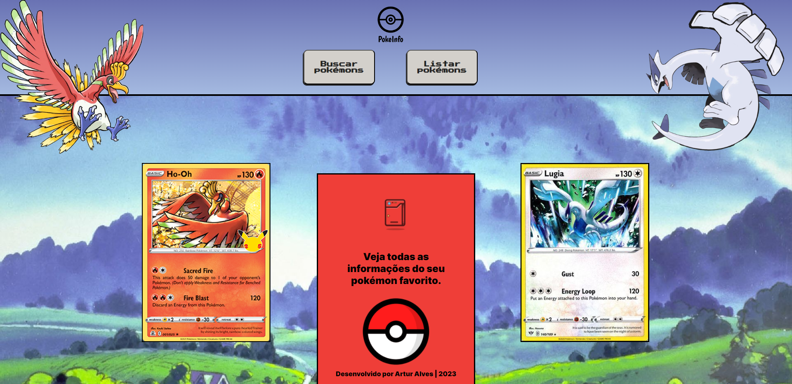
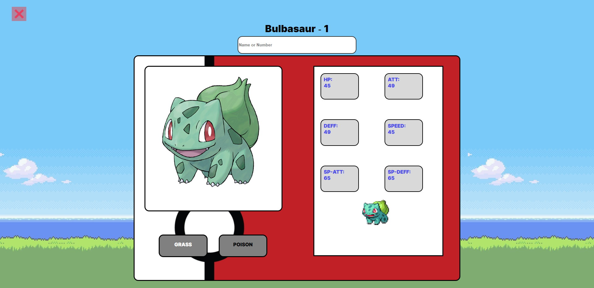
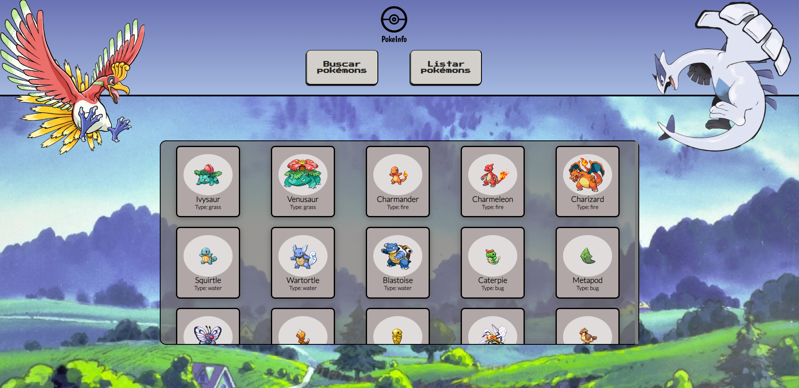

# DS2T - A - Artur Alves

---

---

---
## Link do site
- [Clique aqui para acessar o site](https://poke-info-dm1n6swun-arturalvess.vercel.app/)

## Sobre

Site com temática de pokémon, utilizando a API pública - [PokeAPI](https://pokeapi.co/), com funcionalidades ded listagem e busca específica.

Projeto que busca trabalhar o consumo de API, router e criação de web-components. 
O objetivo deste projeto é colocar em prática os conhecimentos adquiridos no curso do [Senai Jandira](https://jandira.sp.senai.br/). 

---

## Tecnologias Utilizadas

- HTML
- CSS
- JavaScript
- Web Components
- Responsividade
- Markdown
- Figma
- Router

---

## Protótipo do site 

Antes da criação do site, foram feitos os protótipos da parte WEB no Figma.

- [Clique aqui para ver o figma](https://www.figma.com/file/OPobdq25LjwHjboLt82ZXt/Pokemon-API?type=design&t=DaqZZ5sJOYeW8inr-0)

## Autoavaliação 

 - [x] Documentou problemas, se encontrado, para futuras consultas?
 - [x] Foi criado o layout no figma?
 - [x] A página foi construída seguindo o planejado no Figma?
 - [x] A página funciona em dispositivos diferentes?
 - [x] Foi consumida a API escolhida?
 - [x] Foi criado web componentes?
 - [x] Foi criado um padrão de roteamente para as paginas?
 - [x] As funções foram criadas seguindo à boa prática de responsabilidade única?
 - [x] Quando possível, foi criado funções puras?
 - [x] O projeto está publicado?
 - [x] Foi criado o arquivo README.md?

## Autor

- [Artur Alves](https://github.com/ArturAlvess)
